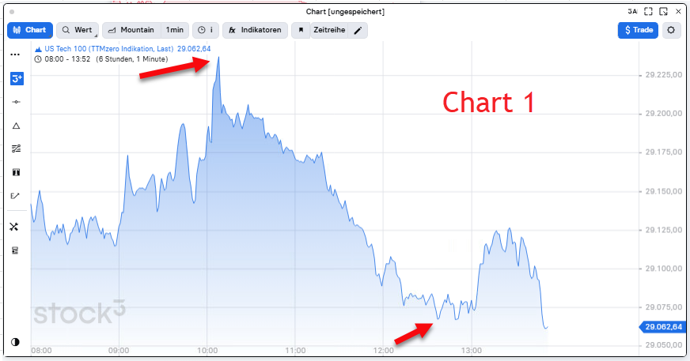
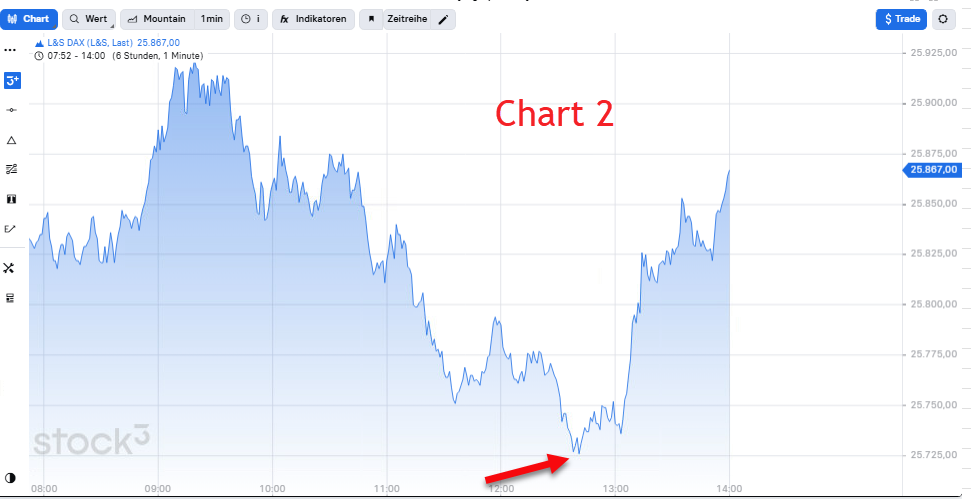
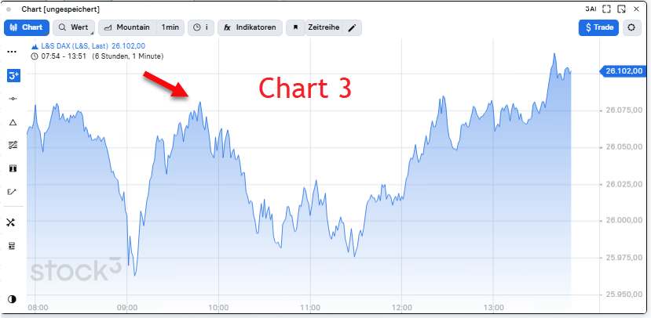
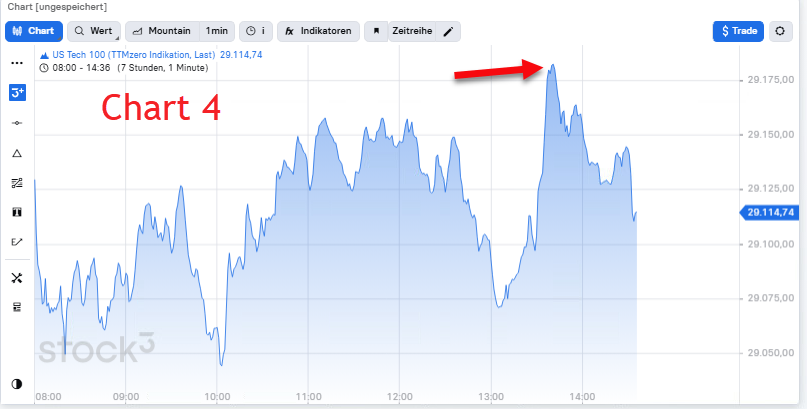
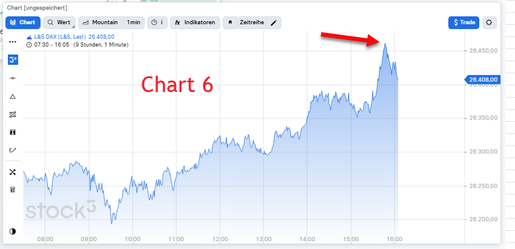

# TradingALARM Referenzcharts xx8

## xx8

### Meine Erklärung

Chart 1 	
Eine klares Tageshoch Nasdaq das es an diesem Tag noch nicht gab um 10:08 Uhr. 	
Das du wahrscheinlich nicht direkt um 10:08 analysierst, kann der Alarm auch beider Analyse ca. 2-3 Minuten vorher oder nachher erfolgen. Du musst es also für möglich halten, dass das 2-3 Minuten später eintrifft. 	
	
Und auch Chart 1	
Ein Tagestief Nasdaq das es an diesem Tag nicht gab um 12:38 Uhr. 	
Das du wahrscheinlich nicht direkt um 12:38 analysierst, kann der Alarm auch beider Analyse ca. 2-3 Minuten vorher oder nachher erfolgen. Du musst es also für möglich halten, dass das 2-3 Minuten später eintrifft. 	

Meiner Erklärung:	

Chart 2	
Ein Tagestief Dax das es an diesem Tag nicht gab um 12:38 Uhr. 	
Das du wahrscheinlich nicht direkt um 12:38 analysierst, kann der Alarm auch beider Analyse ca. 2-3 Minuten vorher oder nachher erfolgen. Du musst es also für möglich halten, dass das 2-3 Minuten später eintrifft. 	

Meine Erklärung:	

Chart 3	
Dax um 9:48 Uhr. 	
Das ist zwar nicht unbedingt ein komplett neues Tageshoch aberdas lassen wir auch gelten, da um 9:48 Uhr das vorherige Hoch erreicht wird.  	
Das du wahrscheinlich nicht direkt um 9:48 analysierst, kann der Alarm auch beider Analyse ca. 2-3 Minuten vorher oder nachher erfolgen. Du musst es also für möglich halten, dass das 2-3 Minuten später eintrifft. 	

Meine Erklärung
Chart 4	
Eine klares Tageshoch Nasdaq das es an diesem Tag noch nicht gab um 13:38 Uhr. 	
Das du wahrscheinlich nicht direkt um 13:38 analysierst, kann der Alarm auch beider Analyse ca. 2-3 Minuten vorher oder nachher erfolgen. Du musst es also für möglich halten, dass das 2-3 Minuten später eintrifft. 	

Meine Erklärung	
	
Chart 6	
Eine klares Tageshoch Nasdaq das es an diesem Tag noch nicht gab um 15:48 Uhr. 	
Das du wahrscheinlich nicht direkt um 15:38 analysierst, kann der Alarm auch beider Analyse ca. 2-3 Minuten vorher oder nachher erfolgen. Du musst es also für möglich halten, dass das 2-3 Minuten später eintrifft. 	

